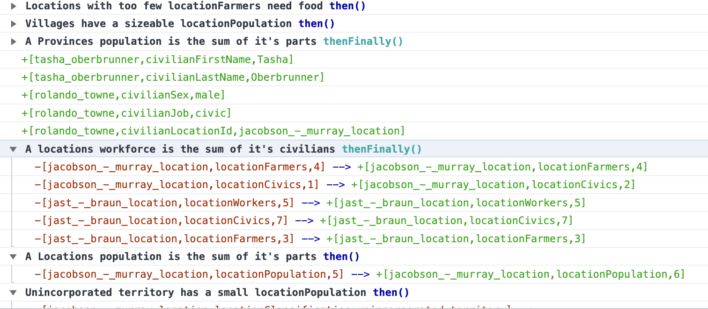

# `edict` is an efficient rule engine in Typescript

`edict` enables declarative reactive programming against _data patterns_.

* **Reactive**: Logic is triggered efficiently when the data changes.
* **Data _patterns_**: Instead of reacting to a specific value, `edict` can react to the creation/mutation of relationships between data points. We call the data patterns _rules_. 
* **Declarative**: dependencies between rules are managed by `edict`, the right logic will execute in the right order without explicitly being defined.

```typescript
type CompanySchema = {
  name: string
  basePrice: number
  markupKind: "FIXED" | "PERCENT"
  markupAmount: number
  parentCompany: string
  overrideParent: boolean
}

// Sessions contain facts and rules
const session = edict<CompanySchema>()

session.rule(
    // Rules can have descriptive names
    'Child companies apply a markup to their price based on their parent companies price',
   
    // Schema should be destructured so we can use the names easily
    ({ basePrice, markupKind, markupAmount }) => ({
      // Prefixing an $ to an id means "all ids that have these attributes", a join. 
      $parent: {
        basePrice,
      },
      
      $child: {
        // $child will match only if the `parentCompany` value matches the $parent id  
        parentCompany: { join: '$parent' },
        basePrice,
        
        // Only match $child who are not overriding their parent
        overrideParent: { match: false },
        markupKind,
        markupAmount,
      },
    })
  )
  .enact({
    then: ({ $parent, $child }) => {
      session.insert({
        [$child.id]: {
          basePrice:
            $child.markupKind === 'FIXED'
              ? $parent.basePrice + $child.markupAmount
              : $parent.basePrice * $child.markupAmount,
        },
      })
    },
  })
```

* [Installation](#installation)
* [Usage](#usage)
  + [The Schema](#the-schema)
  + [The Session](#the-session)
  + [Inserting Facts](#inserting-facts)
    + [Triggering your rules with `fire`](#triggering-your-rules-with-fire)
  + [Queries](#queries)
    - [Use filters to get specific results](#use-filters-to-get-specific-results)
  + [Subscriptions](#subscriptions)
    - [Integrating with React](#integrating-with-react)
  + [Complex Conditions (joins and matches)](#complex-conditions--joins-and-matches-)
    - [Id joins with $](#id-joins-with--)
    - [Attribute joins to relate ids](#attribute-joins-to-relate-ids)
    - [Constraining matches to a specific value](#constraining-matches-to-a-specific-value)
* [Avoiding infinite loops](#avoiding-infinite-loops)
* [Debugging](#debugging)
* [Examples](#examples)
* [Acknowledgements](#acknowledgements)
* [Project Breakdown](#project-breakdown)

## Installation

`yarn add @edict/edict` or `npm i @edict/edict` 

## Usage

### The Schema

The `Schema` describes the shape of your facts, specifically the
types of data that can be associated with an id and value. Later when we insert
a fact it will be clearer how the schema relates to both rules and
facts.

```typescript
type Schema = {
  name: string,
  email: string,
  birthDay: Date,
  isCelebratingBirthDay: boolean,
  sibling: string,
  todaysDate: Date,
};

// This `session` will maintain it's own database of facts and rules. It also will
// expose functions to add/remove new rules and facts, query the facts etc.
//
// `edict` does not create "global" data, each invocation of `edict()` creates
// new independent sessions
const mySession = edict<Schema>();
```

One the key benefits to having an attribute schema is type-safety. `edict` will not allow you to insert
facts with attributes not declared in the schema for that session. The other really nice benefit is that
with proper editor tooling (auto-completion!) it's trivial to explore the space of possible facts and attributes!

### The Session
The value returned from `edict()` is your _session_. With this session you can
add rules, insert facts, and query the current state of its fact database. All of this
is contained to the instance of the session, which means you can have several `edict` sessions
running at once. Perhaps you have a core session managing global application state, and smaller more
specific sessions managing the state of a component, or a session accumulating facts along some request middleware. 
`edict` is helpful at any scale!

Now let's create our first rule!

```typescript
const { rule } = mySession;

const results = rule('When a birthday is today, celebrate the birthday!',
  ({ birthDay, todaysDate }) =>
    ({
      // Matches the fact with id `today` with attribute `todaysDate`
      // This would be inserted like this: `session.insert({today: { todaysDate: new Date() }})`
      today: {
        todaysDate,
      },

      // "$user" is a _bound_ id. By prefixing the id with "$" you signal to edict that
      // you want to match ANY facts with the following attributes that have the same id. 
      // This allows you to "join" many facts to be processed by this rule!
      $user: {
        birthDay,
      },
    }))
    // `rule()` returns an object with `enact()` 
    // `enact()` let's you apply reactions to the
    // rule you've defined, and adds it to the session
    .enact({
      // "when" filters out facts, runs before "then"
      when: ({ $user, today }) => {
        // Match users who have a birthday today!
        return (
          $user.birthDay.getMonth() === today.todaysDate.getMonth() &&
          $user.birthDay.getDate() === today.todaysDate.getDate()
        )
     },

     then: ({ $user }) => {
      insert({ [$user.id]: { isCelebratingBirthDay: true } });
     },
});
```

### Inserting Facts

Now that we have our session, let's insert some facts.

*Note! You need to define rules before your facts are inserted!*

```typescript
// Here is how you would insert multiple facts about different people with names and emails
const { insert } = mySession;

insert({
  // "bob" is the "id", it could be an integer, uuid, whatever makes sense for your application!
  bob: {
    name: 'Bob Johnson',
    email: 'bob@hotmail.com',
    birthDay: new Date('2008-01-19'),
  },
  tom: {
    name: 'Tom Kennedy',
    email: 'tomk@aol.com',
    birthDay: new Date('1967-03-02'),
  },

  // Let's assume these two are twins born on the same day!
  jack: {
    name: 'Jack Maxwell',
    email: 'jack@gmail.com',
    birthDay: new Date('2022-03-02'),
    sibling: "jill"
  },
  jill: {
    name: 'Jill Maxwell',
    email: 'jill@gmail.com',
    birthDay: new Date('2022-03-02'),
    sibling: "jack"
  },

  // Let's pretend it's Tom, Jack and Jill's birthdays!
  today: {todaysDate: new Date('2022-03-02')},
});
```

> Under the hood, facts are represented as entity-attribute-value tuples. So the
> entry "bob" above is internally stored as
> ["bob", "name", "Bob Johnson"], ["bob", "email", "bob@hotmail.com"], etc.
> This enables maximum flexibility for rule definition and engine implementation.
> However a design goal of `edict` is to expose an idiomatic javascript API
> to keep usage ergonomic.

#### Triggering your rules with `fire()`

By default, a session will execute the appropriate rules after every `insert()` or `retract()`. For event driven
applications like web apps this works well. For some use-cases though this can be really inefficient. A good example where 
firing after every insert would be inefficient is the core update loop in a game.

```typescript
const session = edict<Schema>()

const update = (dt: number) => {
    handleInput(dt, session)
    runLogic(dt)
    render(dt)
}
```

Usually in a game loop you want to trigger your rules _once_ per `update`, to do this you can set `autoFire` to false when
creating a session:

```typescript
const session = edict<Schema>(false) // Rules will not trigger on insert/retract

const update = (dt: number) => {
  handleInput(dt, session)
  session.fire() // This will fire the relevant rules based on insert/retracts!
  runLogic(dt)
  render(dt)
}
```

### Queries

The object returned from calling `rule()` contains a function named `enact()`.

The arguments to `enact()` are optional, but allow you to specify what happens when a rule
is triggered by the fact database.

The return value of `enact()` is an object containing the `query()` function. `query()` will
return an array of facts matching your rule.

You don't have to supply arguments to `enact()` by the way! Some rules are more
like queries, and allow you to pull out a subset of the facts matching the conditions
of the rule!

```typescript
const usersCelebratingBirthdays = rule("All users celebrating their birthday", ({ name, isCelebratingBirthDay }) =>
  ({
    $user: {
      name, 
      isCelebratingBirthDay,
    },
  })
).enact(
  { when: ({$user}) => $user.isCelebratingBirthDay }
)

const { fire } = mySession

// fire() will actually trigger your rules. If you call edict like
// this: `edict(true)` then every insert or retraction will automatically
// call `fire()`, which may or may not be what you want depending on your
// use-case.
fire()

const users = usersCelebratingBirthdays.query();

users.forEach(({$user}) => console.log(`${$user.name} is celebrating their birthday!`));
```

#### Use filters to get specific results
Sometimes we want to get very specific subsets of facts, say all the data for
a particular user, but we don't want to make a whole rule specifically for that
user. 

To achieve this, we can pass arguments to `query()` to narrow the results to 
the fact we want

```typescript
// Continuing the example above, let's get jack's facts

const jack = usersCelebratingBirthdays.query({
  $name: {
      ids: ["jack"]
  }
})
```

The object passed into `query` has this shape:
```
{
  sameIdAsCondition: {
    ids: ["array","of","ids"],
    someAttribute: ["array","of","values","to","match"]
  }
}
```

It can be cumbersome to deal with an array of results if you _know_ there 
will just be a single result. In that case you can use `queryOne()`
```typescript

// Return the first matching fact. This is nice if you expect there to be 
// just one result (say for an id you know is unique). Returns `undefined`
// if nothing matches
const justJack = usersCelebratingBirthdays.queryOne({
    $name: {
        ids: ["jack"]
    }
}) 
```

### Subscriptions
To make integrating with reactive frameworks like React or RxJs easy, `edict` also provides
subscription functions. They follow the same patterns as `query()` and `queryOne()`,
exposing `subscribe()` and `subscribeOne()`. These functions also take filter objects
just like `query()`

```typescript
// Whenever facts which would trigger this rule are inserted, the callback
// passed into subscribe will be called. 
const unsub = usersCelebratingBirthdays.subscribe(users => {
    console.log(users)
})

// To stop subscribing, just call the returned callback
unsub()

// You can use a filter object as well, and if you expect a single result there
// is a `subscribeOne` variation
const unsubOne = usersCelebratingBirthdays.subscribeOne(jack => {
    console.log(jack)
},
  { // The filter arg is the second argument
    $users: {
        ids: ["jack"]
    }
})

// Then unsub later:
unsubOne()
```

#### Integrating with React
It's not too hard to integrate this nicely with React, and other frameworks
and libraries should be just as simple (honestly, React is probably the most
complex one to integrate with). Below is an example `useBirthdayCelebrators` hook

```typescript
const useBirthdayCelebrators = () => {
    const [celebrators, setCelebrators] = useState(usersCelebratingBirthdays.query())
    useEffect(() => {
        return usersCelebratingBirthdays.subscribe(users => setCelebrators(users))
    })
    return celebrators
}
```

You'll probably be making quite a few hooks, and it can get tedious doing the above, 
here's a general hook you can use with a given rule so you can focus on data transforming
instead of plumbing

```typescript

// These examples should help expose the types you'll need to
// work with if you want to make general purpose subscriptions
// to rules in other frameworks like RxJs
export const useRuleOne = <SCHEMA extends object, T extends ConditionArgs<SCHEMA>>(
  rule: EnactionResults<SCHEMA, T>,
  filter?: QueryArgs<SCHEMA, T>
) => {
  const [match, setMatch] = useState(rule.queryOne(filter))
  useEffect(() => rule.subscribeOne((d) => setMatch(d), filter))
  return match
}

export const useRule = <SCHEMA extends object, T extends ConditionArgs<SCHEMA>>(
  rule: EnactionResults<SCHEMA, T>,
  filter?: QueryArgs<SCHEMA, T>
) => {
  const [match, setMatch] = useState(rule.query(filter))
  useEffect(() => rule.subscribe((d) => setMatch(d), filter))
  return match
}
```
You can rewrite the `useBirthdayCelebrators` hook with `useRule` like so...

```typescript
const useBirthdayCelebrators = () => useRule(usersCelebratingBirthdays) 
```

### Complex Conditions (joins and matches)

#### Id joins with $
In a rules conditions, any id starting with a `$` is considered a 
_joined id_. Instead of matching on a _specific_ id, the rule will
any set of facts which have the same id AND have an entry for each 
attribute.

The above examples already leverage this, but let's look in a bit more detail
```typescript
const results = rule('All users with a birtday', ({ birthDay }) =>
    ({
      $user: {
        birthDay,
      },
    })).enact()
```

because `$user` starts with a `$`, this rule will apply to all facts which
have an entry for `birthDay`. 

#### Attribute joins to relate ids

Sometimes, you may want to match facts based on their relationship to
each other. The example below illustrates such a condition 

```typescript
rule("Users with same birthday", ({ name, birthDay }) =>
  ({
    $userA: {
      name,
      birthDay,
      sibling: { join: "$userB" }
    },
    $userB: { 
      name,
      birthDay,
      sibling: { join: "$userA" }
    },
  })
).enact(
  {
    when: ({$userA, $userB}) => console.log(`${$userA.name} and ${$userB.name} are siblings!`)
  }
)
```

#### Constraining matches to a specific value
To match your conditions only when a specific value is supplied, you can use
the `{match: someValue}` option on an attribute

```typescript
const bobsBirthDay = rule("Users born on 2008-01-19", ({name}) => ({
  $user: {
    name,
    birthDay: {match: new Date("2008-01-19")}
  }
})).enact()

const bob = bobsBirthDay.queryOne()

// "Bob Johnson"
console.log(bob.$user.name)
```

## Avoiding infinite loops
Sometimes a rule may run an `insert` or `retract` that causes
a rule (or several) to re-trigger infinitely. The solution to this is to mark
which attributes in your conditions should not cause a retrigger. 

```typescript
rule("Updating the date",({todaysDate}) => ({
  today: {
      todaysDate
  } 
})).enact({
  then: ({today}) => {
      // This rule will trigger infinitely 
      insert({
        today: {
            todaysDate: `${new Date()}`
        }
      })
  }
})
```
To remedy this, you can use the `{then: false}` option on an attribute
to ensure the rule can't re-trigger itself in the same `fire()` if that
specific attribute is changed

```typescript
rule("Updating the date",() => ({
  today: {
    todaysDate: {then: false}
  }
})).enact({
  then: ({today}) => {
    // This rule will trigger once.
    // This is obviously a contrived example, generally if
    // an attribute is causing an infinite trigger, that is a 
    // bug
    insert({
      today: {
        todaysDate: `${new Date()}`
      }
    })
  }
})
```
## Debugging 

`edict` supplies a `consoleAuditor()` which when added a session will log nested output to the console
such that it's a little easier to see what facts have been inserted/updated/retracted, and within what rule. 

If you're working in a node application, you'll want to hook into Chrome Devtools to see use the nice nesting 
features. 

```typescript

const auditor = consoleAuditor()
const session = edict<Schema>(
  false,
  auditor
)
```

Then in your browser console you'll be able to enjoy output like this:



## Examples

* [examples](packages/examples/) are where I keep my running versions of apps that use this library for testing.
  * [password validation](packages/examples/react-password) is a really clear and concise example of using rules implementing a familiar requirement!
  * [phaser](packages/examples/phaser-game/) A perf test using phaser. Also shows how to incorporate the `edict` library into your game logic (in a basic way)
  * [cities](packages/examples/react-perf/) This example really digs into nested rules. The goal is to push `edict` performance and show rule usage in a non-trivial way
  * [realworld](packages/examples/react-realworld/) An implementation of [Conduit](https://demo.realworld.io/#/) (by [gothinkster's RealWorldApp](https://github.com/gothinkster/realworld))

## Acknowledgements!

`edict` is inspired by [Zach Oakes'](https://github.com/oakes) libraries [O'doyle rules](https://github.com/oakes/odoyle-rules) and [Pararules](https://github.com/oakes/pararules)!
`edict` aims to bring their ideas into the TypeScript ecosystem!

`edict` leverages the powerful and efficient Rete Algorithm. The [@edict/rete](https://github.com/trevordilley/edict/tree/main/packages/rete) package used in `edict`
is an extremely literal port of [Pararules engine.nim](https://github.com/paranim/pararules/blob/master/src/pararules/engine.nim). This library wouldn't have been
remotely possible without Zach's work. This library stands on his shoulders in every way!

(Also, if Javascript didn't allow `$` in the variable names, or allow the simple syntax of json attribute names, this libraries API wouldn't have worked either.)

I'd also like to thank my youngest child for waking me up at god-awful early hours to "flatten his blanket" and "turn his pillow the other way", allowing me plenty of
early mornings to keep on this work!

## Project Breakdown
* [@edict/edict](packages/edict/) is the main library used by other applications
* [@edict/rete](packages/rete/) this is the port from Pararules that does all the heavy lifting. It's a separate library so anyone that wants to leverage a robust rules engine implementation in the javascript ecosystem can do so!
